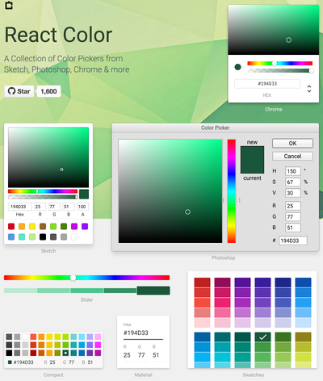

React-Color
==============

React Color Pickers with 7 themes - Sketch, Chrome, Photoshop, Slider, Compact, Material, Swatches packaged for Meteor

* **7 Different Pickers** - Sketch, Photoshop, Chrome and many more

* **Popup or Block** - It can be used it as a popup or always visible

* **Make Your Own** - Use the building block components to make your own



This package is a wrapper around [React-Color](https://github.com/casesandberg/react-color)

### Adding it to your project

~~~
meteor add praneybehl:react-color
~~~

## DEMO

http://casesandberg.github.io/react-color/

Usage
=====

```

class Component extends React.Component {

  render() {
    return <ColorPicker type="sketch" />;
  }
}
```

### Display It
Display the color picker popup on click, or don't define display and it will always be visible.

```


class Component extends React.Component {

  constructor() {
    super();
    this.state = {
      displayColorPicker: false,
    };
    this.handleClick = this.handleClick.bind(this);
  }

  handleClick() {
    this.setState({ displayColorPicker: !this.state.displayColorPicker });
  }

  render() {
    return (
      <div>
        <button onClick={ this.handleClick }>Pick Color</button>
        <ColorPicker display={ this.state.displayColorPicker } type="sketch" />
      </div>
    );
  }
}
```
